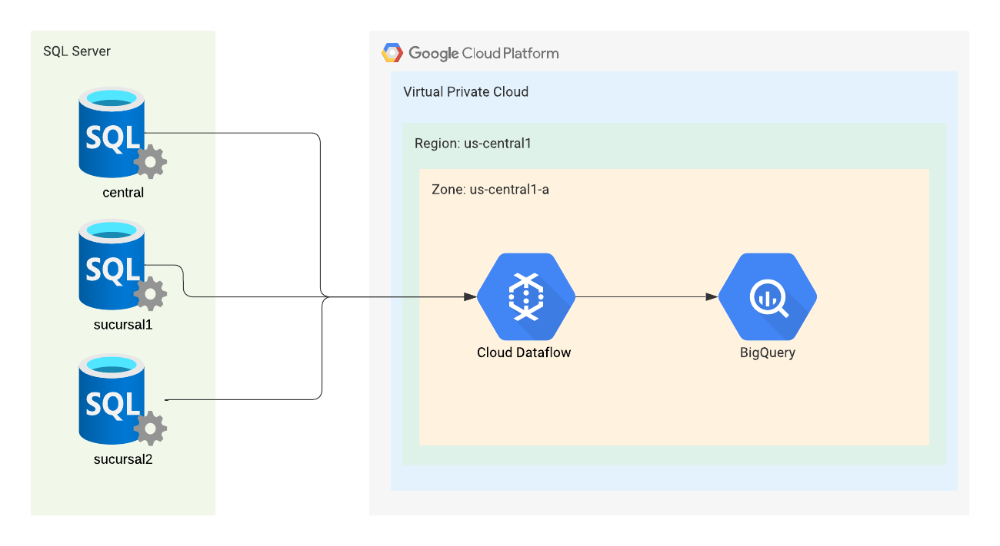

# Arquitectura


Esta arquitectura toma como requerimiento el uso de CDC para capturar los cambios en la base de datos y replicarlos a Big Query mediante Dataflow en un esquema batch.

# Pasos a seguir
1. Iniciar las bases de datos, aplicar CDC en las bases así como en las tablas individuales
```SQL
CREATE DATABASE central;

USE central;
CREATE TABLE CatLineasAereas (
    code CHAR(2) CONSTRAINT PK_CatLineasAereas PRIMARY KEY,
    Linea_Aerea VARCHAR(150) NOT NULL
);

USE central;
GO
EXEC sys.sp_cdc_enable_db;
GO

EXEC sys.sp_cdc_enable_table
    @source_schema = N'dbo',
    @source_name = N'CatLineasAereas',
    @role_name = NULL,
GO
```

2. Insertar los datos
```SQL
USE central;
INSERT INTO CatLineasAereas (code, Linea_Aerea)
VALUES 
('AA','American Airlines'),
('SW','Southwest'),
('AM','Aeromexico'),
('AV','Avianca'),
('KL','KLM');


```
3. Crear un proyecto en Google Cloud Platform, en este caso el proyecto se llama `secret-device-351901`
4. Inicializar una instancia de Cloud Storage, Dataflow y Big Query
5. En Big Query, crear el esquema y las tablas. 
```SQL
CREATE SCHEMA deacero_test;

CREATE TABLE `secret-device-351901.deacero.CatLineasAereas` (
    Code STRING,
    Linea_Aerea STRING
);

CREATE TABLE `secret-device-351901.deacero_test.pasajeros` (
    ID_Pasajero NUMERIC,
    Pasajero STRING,
    Edad NUMERIC
);

CREATE TABLE `secret-device-351901.deacero_test.vuelos` (
    Sucursal NUMERIC,
    Cve_LA STRING,
    Viaje DATE,
    Clase STRING,
    Precio NUMERIC,
    Ruta STRING,
    Cve_Cliente NUMERIC
);
```
6. En Cloud Storage, crear un Bucket y un sub-folder en donde guardaremos el JDBC
7. En Dataflow, iniciar un job con la opcion "Create Job from Template". Donde buscamos y seleccionamos "SQL Server to Big Query". Para efecto de tener la mayor cantidad de código relevante a este proceso, se incluye el código que se usa para generar ese template
8. Iniciar el job

# Conclusiones
- Uno de los principales retos fue determinar la mejor manera de hacer la extracción de los datos hacia GCP sin utilizar replicadores costosos como Data Fusion, que aunque útil en su sencillez, se tendría que hacer un análisis de uso con mayor profundidad para determinar si su precio se justifica
- De manera similar, existe la opción más "nativa" para SQL Server de crear instancias espejo en Cloud SQL usando transactional replication. Sin embargo opte por conectar Data Flow directamente pues exportar la de Cloud SQL a Big Query requiere un intermediario como Data Flow.
